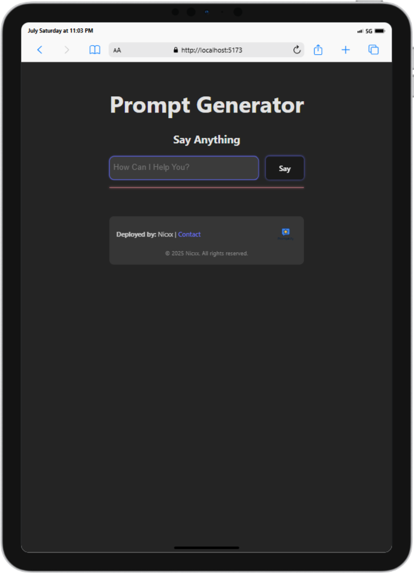
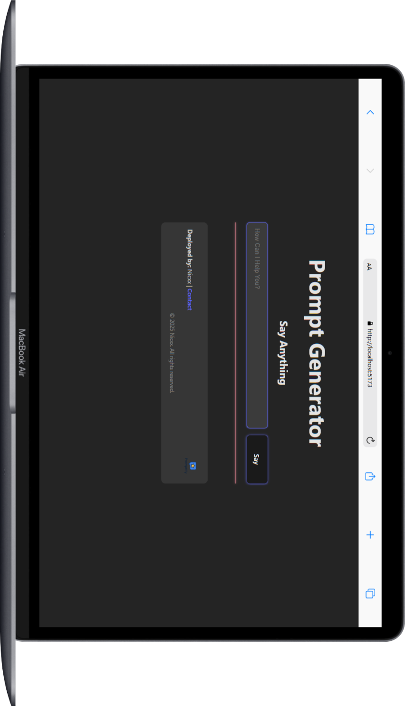

# PromptGenerator 🚀

**PromptGenerator** is a lightweight, user-friendly tool (CLI or web-based) for crafting high-quality prompts tailored for AI systems like GPT, Midjourney, DALL·E, Stable Diffusion, Gemini, Claude, and more. Perfect for prompt engineers, AI artists, writers, and developers.

---

## 🔍 Features

- **🎯 Category-based prompt templates** — e.g., "fantasy landscape", "marketing hook", "chatbot persona"
- **Expandable prompts** — add adjectives, styles, artists, lighting, etc.
- **Include negative prompts** (for image models like Stable Diffusion)
- **Easy export** — copy to clipboard or save as `.txt`
- **Optional UI** — interactive CLI or minimal web interface

---





### Installation

```bash
git clone https://github.com/Paradva-Niraj/PromptGenerator.git
cd PromptGenerator
npm install
